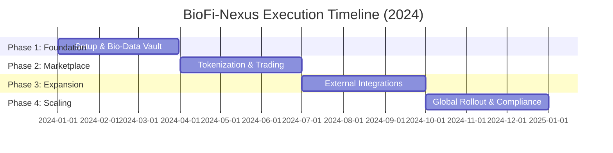
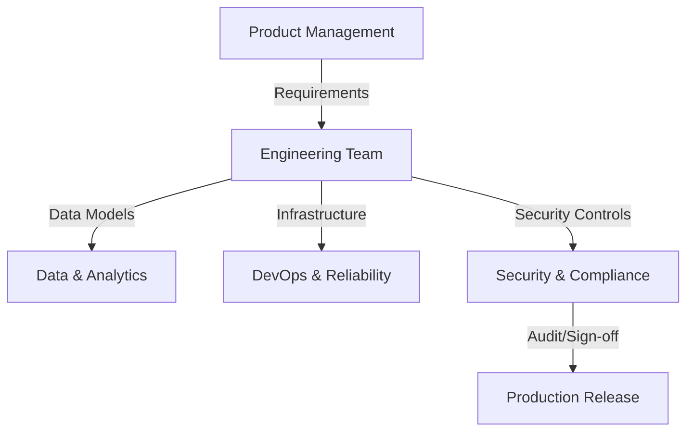
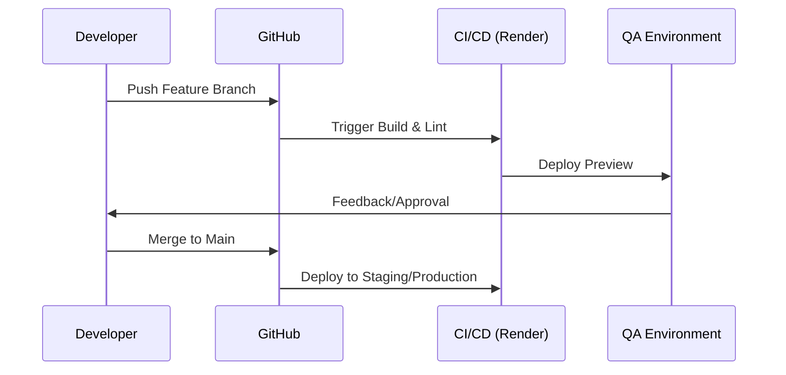

# Execution Plan - BioFi-Nexus

This document describes the structured execution framework for BioFi-Nexus and expands on the goals and roadmap defined in the [PRD](./PRD.md). It aligns teams on scope, ownership, deliverables, and measurable outcomes across each phase.

---

## 1. Introduction
BioFi-Nexus is delivered through an iterative, four-phase model designed to balance rapid product development with rigorous security, data governance, and regulatory compliance.

### 1.1 Vision & Objectives
- **Deliver a secure Bio-Data Vault** as the foundation for bio-asset creation.
- **Launch a compliant marketplace** that enables tokenization and trading of bio-data assets.
- **Enable interoperability** with external biomedical data sources and partner APIs.
- **Scale globally** with enterprise-grade reliability, monitoring, and compliance certifications.

---

## 2. Execution Timeline

---

## 3. Work Breakdown Structure (WBS)
| Level 1 (Phase) | Level 2 (Workstream) | Level 3 (Key Outputs) |
| :--- | :--- | :--- |
| Phase 1: Foundation | Platform Infrastructure | Render/Supabase environments, CI/CD, core services |
|  | Identity & Access | Auth flows, RBAC, audit logging |
|  | Bio-Data Vault | Encrypted storage, metadata schema, ingestion pipeline |
| Phase 2: Marketplace | Tokenization Engine | Asset creation workflows, valuation logic |
|  | Bio-Marketplace MVP | Listings, bids, transactions, settlement |
|  | Ledger & Auditability | Transaction ledger, reporting |
| Phase 3: Expansion | External Integrations | EHR/genomic connectors, API gateway |
|  | Analytics & Insights | Dashboards, alerts, insights APIs |
| Phase 4: Scaling | Compliance & Certification | HIPAA/GDPR audits, controls, certifications |
|  | Global Operations | Multi-region deployment, DR plan |
|  | Advanced Financial Tools | Forecasting, valuation models |

---

## 4. Phase Plans & Milestones

### 4.1 Phase 1: Foundation & MVP (Q1)
**Focus**: Core infrastructure, identity management, and the Bio-Data Vault.

**Milestones**
- [ ] **M1.1 Infrastructure Setup**: Render + Supabase environments provisioned and secured.
- [ ] **M1.2 Identity & Access Management (IAM)**: Auth, RBAC, audit logging implemented.
- [ ] **M1.3 Bio-Data Vault (v1)**: Encrypted storage and metadata services complete.
- [ ] **M1.4 Internal Alpha**: End-to-end ingestion and retrieval validated.

**Exit Criteria Checklist**
- [ ] CI/CD pipelines configured with automated checks.
- [ ] Encryption-at-rest and in-transit verified.
- [ ] API documentation baseline published (OpenAPI/Swagger).
- [ ] Initial security architecture review completed.

### 4.2 Phase 2: Marketplace & Tokenization (Q2)
**Focus**: Creating value from data through tokenization and the Bio-Marketplace.

**Milestones**
- [ ] **M2.1 Asset Tokenization Engine**: Asset creation and valuation workflows ready.
- [ ] **M2.2 Bio-Marketplace MVP**: Listing, search, and bidding features live.
- [ ] **M2.3 Transaction Ledger**: Immutable audit trail for asset trades.

**Exit Criteria Checklist**
- [ ] Ledger integrity checks or smart contract templates validated.
- [ ] Payment gateway integration for marketplace transactions.
- [ ] Marketplace UI/UX approved for beta.

### 4.3 Phase 3: Integration & Advanced Analytics (Q3)
**Focus**: Interoperability and actionable insights for partners.

**Milestones**
- [ ] **M3.1 External Data Adapters**: EHR/genomic connectors operational.
- [ ] **M3.2 Analytics Dashboard**: Real-time insights and trend analytics delivered.
- [ ] **M3.3 Bio-Data API Ecosystem**: Partner-facing API and developer onboarding.

**Exit Criteria Checklist**
- [ ] Integration testing with at least two external data sources.
- [ ] Performance optimization for large-scale queries.
- [ ] Feedback loop for dashboard features established.

### 4.4 Phase 4: Scaling & Compliance (Q4)
**Focus**: Enterprise readiness, compliance certification, and global rollout.

**Milestones**
- [ ] **M4.1 Regulatory Certification**: HIPAA/GDPR compliance audits complete.
- [ ] **M4.2 Advanced Financial Tools**: Predictive valuation models released.
- [ ] **M4.3 Global Launch**: Multi-region production deployment live.

**Exit Criteria Checklist**
- [ ] Full penetration test and remediation sign-off.
- [ ] Disaster recovery and business continuity plan verified.
- [ ] Global onboarding and marketing collateral finalized.

---

## 5. Roles & Responsibilities (RACI)
Clear ownership across cross-functional teams ensures consistent execution and accountability.

### 5.1 RACI Matrix
| Task | Product | Engineering | Data/Analytics | Security/Legal | DevOps | QA/Compliance |
| :--- | :---: | :---: | :---: | :---: | :---: | :---: |
| Architecture & Roadmap | A | R | C | C | I | I |
| Bio-Data Vault Delivery | C | R | C | I | C | I |
| Marketplace & Tokenization | C | R | C | I | I | C |
| Analytics & Insights | C | C | R | I | I | C |
| Compliance Audits | C | I | I | R | C | A |
| Deployment & Reliability | I | C | I | I | R | C |

> **R**: Responsible, **A**: Accountable, **C**: Consulted, **I**: Informed

### 5.2 Ownership Flow

---

## 6. Documentation & Delivery Artifacts
| Artifact | Owner | Phase | Purpose |
| :--- | :--- | :--- | :--- |
| Product Requirements (PRD) | Product | Phase 1 | Scope and goals alignment |
| Solution Architecture | Engineering | Phase 1 | System design and dependencies |
| Data Governance Plan | Security/Legal | Phase 1 | Policy, retention, privacy controls |
| API Specifications | Engineering | Phase 1-3 | Contract for services and integrations |
| Marketplace Operations Guide | Product | Phase 2 | Listing, trading, support workflows |
| Integration Playbook | Engineering | Phase 3 | Partner onboarding, API usage |
| Compliance Audit Report | Security/Legal | Phase 4 | Certification evidence |
| Runbooks & DR Plan | DevOps | Phase 4 | Operational readiness |

---

## 7. Risk, Quality, & Compliance Controls
- **Risk Register**: Maintained weekly with impact/likelihood scoring and mitigations.
- **Security Reviews**: Threat modeling, encryption validation, and access reviews per release.
- **Quality Gates**: Automated tests, code reviews, and performance benchmarks required for phase exit.
- **Regulatory Compliance**: HIPAA/GDPR checklists, privacy impact assessments, audit-ready logs.
- **Data Ethics**: Consent tracking, anonymization standards, and data usage governance.

---

## 8. Monitoring, Metrics, & Reporting
Execution and platform performance are tracked with a unified metric set.

### 8.1 Execution Metrics
| Metric | Target |
| :--- | :--- |
| Milestone On-Time Completion | ≥ 90% |
| Sprint Goal Attainment | ≥ 85% |
| Open Critical Risks | 0 |
| Documentation Freshness | Updated within 2 weeks of change |

### 8.2 Platform KPIs
| Metric Type | KPI | Initial Target |
| :--- | :--- | :--- |
| **Performance** | API Response Time (p95) | < 200ms |
| **Engagement** | Active Researchers | 50+ |
| **Security** | Critical Vulnerabilities | 0 |
| **Quality** | Test Coverage | > 85% |
| **Infrastructure** | System Uptime | 99.9% |

### 8.3 Reporting Cadence
- **Weekly**: Milestone status, risk register review.
- **Bi-Weekly**: Sprint reviews and demo updates.
- **Quarterly**: Phase readiness assessment and KPI reporting.

---

## 9. Operational Workflows

### 9.1 Development Workflow

### 9.2 Data Ingestion Workflow
1. **Request**: Researcher initiates data upload.
2. **Validation**: Automated schema and compliance checks.
3. **Encryption**: Client-side or server-side encryption applied.
4. **Storage**: Data committed to the Bio-Data Vault.
5. **Indexing**: Metadata indexed in Supabase for searchability.

---

## 10. Master Checklist Summary
- [ ] PRD and architecture aligned across teams.
- [ ] Security, privacy, and compliance controls implemented.
- [ ] Data governance and consent policies documented.
- [ ] Marketplace operations and support workflows defined.
- [ ] Monitoring, alerting, and incident response runbooks complete.
- [ ] Compliance audits signed off before global launch.

---

## 11. Governance & Communication
- **Weekly Syncs**: Progress updates against milestones.
- **Sprint Retrospectives**: Continuous improvement of workflows.
- **Document Updates**: This Execution Plan is a living document and will be updated as the project evolves.
