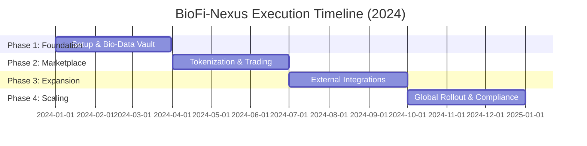
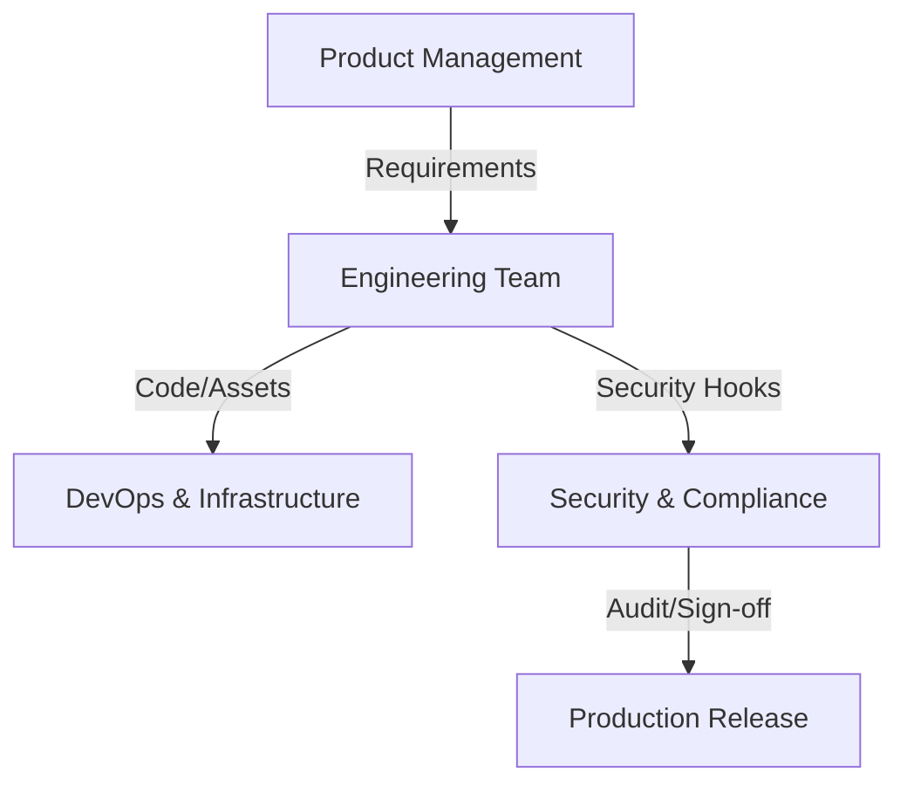
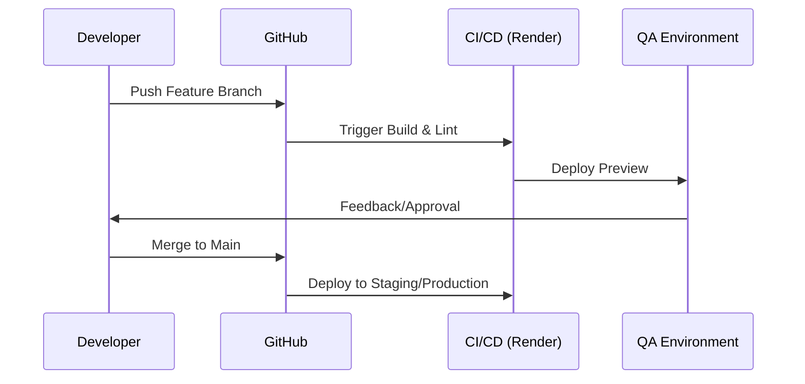

# Execution Plan - BioFi-Nexus

This document outlines the expanded execution framework for the BioFi-Nexus platform, detailing the phases, milestones, roles, and operational workflows required to achieve the project goals defined in the [PRD](./PRD.md).

---

## 1. Project Overview & Strategy
BioFi-Nexus follows an iterative, four-phase delivery model designed to balance rapid development with high standards of security and regulatory compliance.

### Execution Timeline

---

## 2. Phase 1: Foundation & MVP (Q1)
**Focus**: Core infrastructure, identity management, and the Bio-Data Vault.

### 2.1 Milestones
- [ ] **M1.1 Infrastructure Setup**: Deployment environments on Render and Supabase initialized.
- [ ] **M1.2 Identity & Access Management (IAM)**: Secure authentication and RBAC (Role-Based Access Control) implemented.
- [ ] **M1.3 Bio-Data Vault (v1)**: Encrypted storage and metadata management for biological datasets.
- [ ] **M1.4 Internal Alpha**: Completion of basic end-to-end data ingestion and retrieval.

### 2.2 Phase 1 Checklist
- [ ] CI/CD pipelines configured.
- [ ] Encryption-at-rest and in-transit verified.
- [ ] API documentation (Swagger/OpenAPI) baseline.
- [ ] Initial security audit of Vault architecture.

---

## 3. Phase 2: Marketplace & Tokenization (Q2)
**Focus**: Creating value from data through tokenization and the Bio-Marketplace.

### 3.1 Milestones
- [ ] **M2.1 Asset Tokenization Engine**: Workflow for converting datasets into tradable digital entities.
- [ ] **M2.2 Bio-Marketplace MVP**: Listing, searching, and bidding functionality.
- [ ] **M2.3 Transaction Ledger**: Immutable audit trail for all data asset trades.

### 3.2 Phase 2 Checklist
- [ ] Smart contract templates (if applicable) or Ledger integrity checks.
- [ ] Payment gateway integration for marketplace transactions.
- [ ] Frontend marketplace UI/UX completion.

---

## 4. Phase 3: Integration & Advanced Analytics (Q3)
**Focus**: Interoperability and providing actionable insights.

### 4.1 Milestones
- [ ] **M3.1 External Data Adapters**: Connectors for EHR systems and genomic databases.
- [ ] **M3.2 Analytics Dashboard**: Real-time visualization of data value and research trends.
- [ ] **M3.3 Bio-Data API Ecosystem**: Public/Partner API for external developers.

### 4.2 Phase 3 Checklist
- [ ] Integration testing with at least two external bio-databases.
- [ ] Performance optimization for large-scale data queries.
- [ ] User feedback loop implementation for dashboard features.

---

## 5. Phase 4: Scaling & Compliance (Q4)
**Focus**: Global presence and enterprise-grade certification.

### 5.1 Milestones
- [ ] **M4.1 Regulatory Certification**: Formal HIPAA/GDPR compliance audit.
- [ ] **M4.2 Advanced Financial Tools**: Predictive modeling for bio-asset valuation.
- [ ] **M4.3 Global Launch**: Full production release with multi-region support.

### 5.2 Phase 4 Checklist
- [ ] Full penetration test and remediation.
- [ ] Disaster recovery and business continuity plan verification.
- [ ] Marketing and onboarding materials finalized.

---

## 6. Roles & Responsibilities (RACI)
Effective execution relies on clear ownership across cross-functional teams.

### 6.1 RACI Matrix
| Task | Product | Engineering | Security/Legal | DevOps |
| :--- | :---: | :---: | :---: | :---: |
| Architecture Design | C | R | A | I |
| Data Vault Development | I | R | C | C |
| Compliance Audits | C | I | R | A |
| Deployment/Infra | I | C | I | R |

> **R**: Responsible, **A**: Accountable, **C**: Consulted, **I**: Informed

### 6.2 Ownership Flow

---

## 7. Operational Workflows

### 7.1 Development Workflow

### 7.2 Data Ingestion Workflow
1. **Request**: Researcher initiates data upload.
2. **Validation**: Automated schema and compliance check.
3. **Encryption**: Client-side or Server-side encryption applied.
4. **Storage**: Data committed to Bio-Data Vault.
5. **Indexing**: Metadata indexed in Supabase for searchability.

---

## 8. Metrics & KPIs
To track the success of execution, the following metrics will be monitored:

| Metric Type | KPI | Target (End of Q1) |
| :--- | :--- | :--- |
| **Performance** | API Response Time | < 200ms (p95) |
| **Engagement** | Number of Active Researchers | 50+ |
| **Security** | Critical Vulnerabilities | 0 |
| **Quality** | Test Coverage | > 85% |
| **Infrastructure** | System Uptime | 99.9% |

---

## 9. Governance & Communication
- **Weekly Syncs**: Progress updates against milestones.
- **Sprint Retrospectives**: Continuous improvement of workflows.
- **Document Updates**: This Execution Plan is a living document and will be updated as the project evolves.
